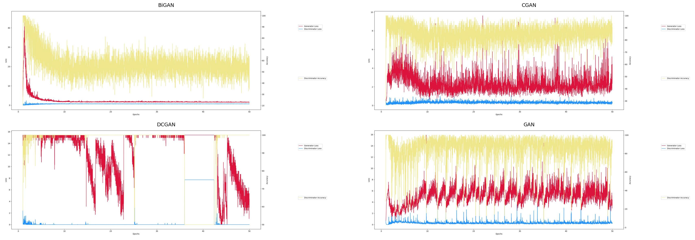
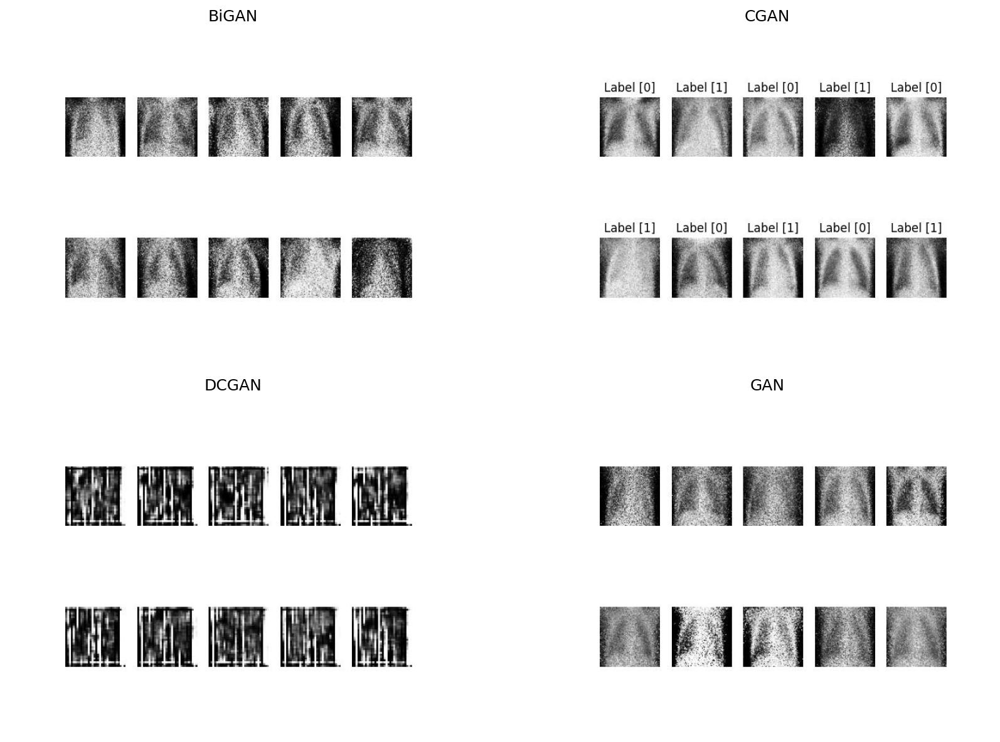

# Chest X-ray image generation using GANs

The objective is to implement and compare types of Generative Adversarial Networks (GANs). The exploration involves 4 GAN architectures: GAN, DCGAN(Deep Convolutional GAN), CGAN(Conditional GAN), and BiGAN(Bidirectional GAN). The primary focus is on conducting a comparative study to assess their efficacy in generating chest X-ray images illustrating both normal and pneumonia affected conditions

# Implemented GAN acrhitectures

1. GAN (Generative Adversarial Network): Traditional GAN. https://dl.acm.org/doi/abs/10.1145/3422622
2. DCGAN (Deep Convolutional GAN): Uses CNNs in generator and discriminator to capture spatial features. https://arxiv.org/abs/1511.06434v2
3. CGAN (Conditional GAN): Incorporates additional information, called conditioning information, such as target labels of images, during training process. https://arxiv.org/abs/1411.1784
4. BiGAN (Bidirectional GAN): It not only maps latent samples to generated data, but also has an inverse mapping from data to latent representation, this is achieved by making use of encoder network alongside the generator and discriminator. https://arxiv.org/abs/1605.09782

# Dataset Used

The dataset utilized for this project is available via following link: [Chest X-ray classification dataset](https://huggingface.co/datasets/keremberke/chest-xray-classification). For the models implemented, only training data from this dataset has been used.

### Accessing the dataset

- Install dataset

```
pip install datasets
```

- Load dataset

```
from datasets import load_dataset

df = load_dataset("keremberke/chest-xray-classification", name="full")
train_df = df['train']
```

# Directory Descriptions

1. `generated_images_{ganName}/`: contains images generated by each respective GAN architecture (`bigan`, `cgan`, `dcgan`, `gan`).
2. `models/`: includes individual python scripts for each architecture.
3. `data_loader.py`: python script used to load the dataset for training models

# Usage

1. Clone the repository

```
git clone https://github.com/varad0207/GANs.git
```

2. Load the dataset

```
mkdir data
python data_loader.py
```

3. Navigate to model directory

```
cd models
```

4. Run GAN model scripts - for example to run traditional GAN

```
python gan.py
```

You can change number of epochs and batch_size as per your wish, i have used 50 epochs and batch_size of 32.

5. Generating images - the scripts will execute and train respective models. The generated images will be saved in their respective generated images directory

# Conclusions

## Comparative Analysis of Losses

Below are the comparative plots illustrating the generator and discriminator losses and discriminator accuracy for each GAN architecture after 50 epochs



## Comparison of Generated Images

The images below showcase a comparison of images generated by each GAN after 50 epochs with a batch size of 32



# Observations

Based on the observed trends in the performance of different GAN architectures:

1. BiGAN shows a balanced performance with a gradual decrease in generator loss, stable discriminator loss, and accuracy settling around 50%. This indicates its ability to generate realistic images while maintaining equilibrium between the generator and discriminator.
2. CGAN maintains a relatively stable discriminator loss with high accuracy around 90%. This suggests its ability to distinguish between real and generated images consistently.
3. GAN demonstrates moderate stability in both generator and discriminator losses, with the discriminator accuracy stabilizing around 90%. It shows potential in generating images with decent quality.
4. DCGAN, while having a consistently low discriminator loss, faces challenges in the generator's performance, leading to fluctuating generator losses. The discriminator's near 100% accuracy indicates overfitting or an excessively confident discriminator.

### Final Analysis:

- BiGAN stands out for its ability to strike a balance between generating realistic images and maintaining equilibrium in the adversarial process.
- CGAN and GAN display decent performance with consistent discriminator behavior, although their generator losses show different trends.
- DCGAN showcases an issue with discriminator overconfidence despite having low discriminator loss, suggesting potential issues with the generator's performance.

These conclusions are based on the observed trends and aim to provide insights into the strengths and weaknesses of each GAN architecture in generating chest X-ray images depicting normal and pneumonia-affected conditions.

# References

The model architectures implemented in this project were adapted and inspired by https://github.com/eriklindernoren/Keras-GAN
